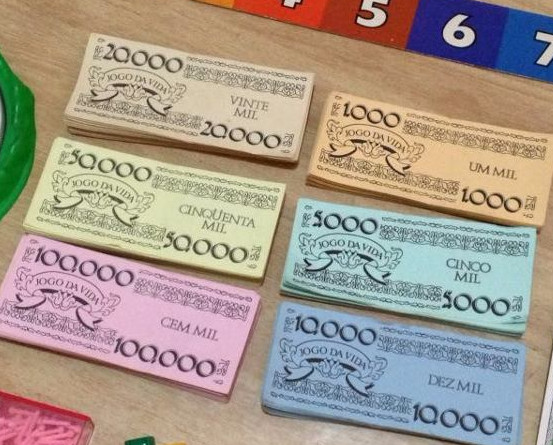
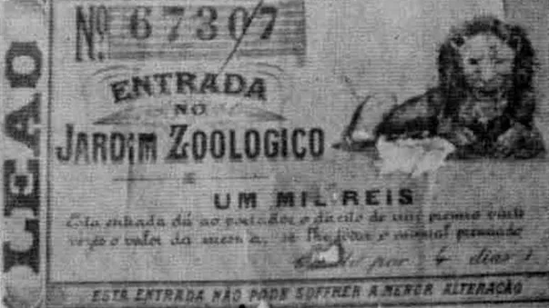
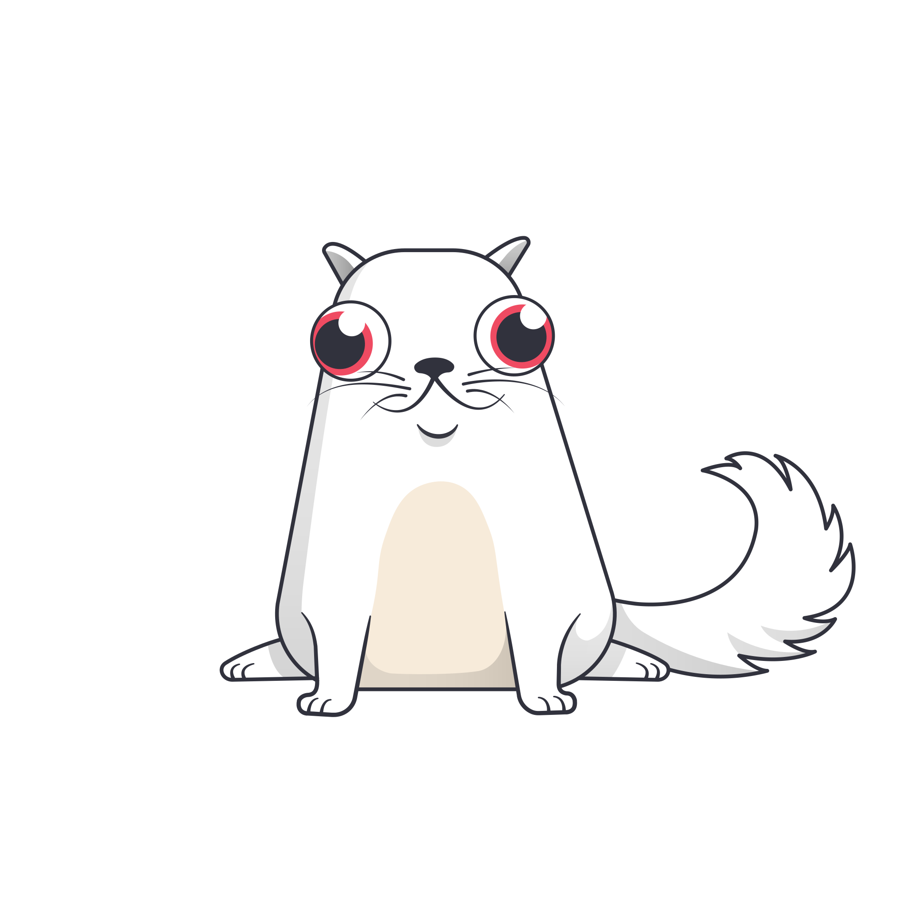
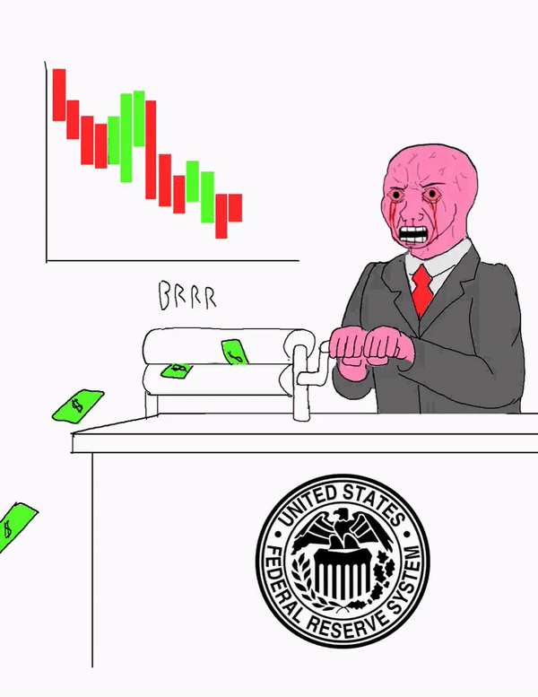

# NTF em 10 Minutos

uma demo de algo web3

<div class="pt-12">
    Fabricio C Zuardi, Abril 2022
</div>

<div class="abs-br m-6 flex gap-2">
  <a href="https://github.com/titulos/nft-101" target="_blank" alt="GitHub"
    class="text-xl icon-btn opacity-50 !border-none !hover:text-white">
    <carbon-logo-github />
  </a>
</div>

<!--
Olá, meu nome é Fabricio e hoje vamos falar de NFTs.
-->

---
class: 'text-center'
layout: 'fact'
---

# AVISO:

<!--
Antes de começar, um pequeno disclaimer:
-->
---
layout: statement
background: ./snakes.jpg
class: 'text-center'
---

## Esta apresentação pode conter <twemoji-pile-of-poo /> <q>[shitcoins](https://bitcoinmagazine.com/culture/why-bitcoin-isnt-crypto)</q>


#### conhecer não é endossar, mantenha a mente aberta

<!--
esta apresentação pode conter shitcoins
-->
---
background: https://source.unsplash.com/collection/94734566/1920x1080
layout: cover
---

# NFT é um bilhete
## Fichas e certificados de nossas vidas

<!--
Muito bem

Vamos falar de bilhetes e de seus conteúdos.

Um bilhete pode ser algo tão simples quanto um pedaço de papel com um número rabiscado em cima.

Uma senha de atendimendo na fila do açougue é isso, o número num bilhete de rifa e o ingresso pro
circo também são isso.

Um bilhete pode ser um pouquinho mais elaborado, como a nossa certidão de nascimento,
nosso título de eleitor, nossa carteira de motorista.

O nosso dinheiro em papel também é um bilhete. Bem sem graça, e a função do BACEN
é convencer todos os brasileiros de que "é verdade esse bilhete".
-->

---
layout: default
---

# Cinco Objetos

- ficha com a senha do restaurante de shopping
  - tem um núrero, que representa o prato que eu comprei
- bilhete de rifa
  - tem um número, que pode representar a bicicleta de prêmio, se sorteado
- entrada pro zoológico
  - tem um código impresso nele, que representa meu direito de entrar na sala
- documento de carro
  - tem um código RENAVAM, que identifica um único veículo desde sua fabricação até o descarte
- cédula de 50 Reais
  - tem um código, que representa a série, a ordem e a estampa

<!--
Separei 5 objetos do cotidiano:

1. senha de fila
2. bilhete de rifa
3. entrada para o zoológico
4. documento do carro
5. uma nota de Cinquentao

Cada uma delas possui um identificador que representa alguma outra coisa.

Eu escolhi estes objetos para poder mostrar uma característica de alguns bilhetes.

A fungibilidade.
-->
---
layout: two-cols
---

# Bens Fungíveis

**Fungível**: Que pode ser substituído por outro do mesmo genero, da mesma qualidade ou quantidade

<v-click>

**Fungíveis**
- entrada pro zoológico
- cédula de 50 Reais

**Não-fungível**
- ficha com a senha do restaurante de shopping
- bilhete de rifa
- documento de carro

</v-click>


::right::


<p style="text-align: center">Dinheiro de papel é um bem fungível</p>

<!--
Um bem fungível é um que pode ser substituído por outro do mesmo gênero.

Se eu pegar 20 reais emprestado hoje, eu não preciso devolver a mesma nota com o mesmo número
de série quando eu for pagar minha dívida.

Dos 5 objetos do slide passado então, podemos considerar dois deles fungíveiss: o dinheiro e a entrada do zoológico

um NFT é um bilhete desse segundo grupo, o grupo dos não-fungíveis.
-->
---
layout: statement
---

# NFT


|  |  |  |  |
|---|---|---|---|
| **N F** | Non-Fungible | não-fungível | único, identificável, insubstituível |
| **T** | Token | ficha, título, certificado | pode ter dono, pode ser transferido |



<!--
A sigla NFT significa non-fungible token.

Token no sentido de ficha, bilhete, ticket, certificado, símbolo.

Eu anteriormente listei como fungível a entrada do zoológico, mas se houvesse algum sorteio de 
brindes com base no numero de série do bilhete, ou do animal impresso, este bilhete no contexto do sorteio 
passaria a ser NFT também.

Nessa idéia de ficha não-fungível, a ficha pode ter um dono, um portador, pode estar com alguém,
e pode ser transferido para outra pessoa, outro endereço. 

E eu quero pegar este gancho da posse para falar de posses no mundo dos dados, no mundo da informação.
-->

---
layout: cover
background: https://source.unsplash.com/collection/94734566/1920x1080
---

# Posses digitais

---
layout: two-cols
---

# Exemplos de posses digitais:

- endereço de email <uim-at /> 
- usernames <uim-twitter-alt /> <uim-github-alt /> <uim-instagram /> <uim-facebook-f />
- nome nos créditos de um filme <carbon-logo-youtube />
- troféus e _achievements_ em jogos <carbon-trophy />
- vestuário, armas e outros ítens em jogos online <carbon-gift />
- acesso a eventos ou temporadas de jogos online <carbon-ticket />
- badges em chats de streaming ou fóruns <carbon-badge />
- genes de um avatar em coleção generativa <carbon-dna />
::right::

<v-click>

<twemoji-warning />Observação

Nada disso é novidade. E nada disso precisa de dApp ou blockchain.

</v-click>

```json
{
  "id": "379413",
  "owner": "fabricio",
  "metadata": {...}
}
```

<!--
O mundo digital é feito de dados, de informação.

esta idéia de NFT pode funcionar nesse mundo para representar a posse de alguma coisa rara, única
ou pessoal.

Listei aqui alguns exemplos de coisas que informalmente consideramos sermos os donos delas no
mundo digital.

Um endereço de email, uma conta em rede social, nossa coleção de conquistas em jogos, tickets
para eventos online, bottoms virtuais em chat, ou colecionáveis de uma coleção de arte gerada, 
alguma combinação específica de genes que resultam em uma figurinha única da coleção.

=================

No mundo digital, representar uma "posse" dessas é questão de gerenciar uma linha de uma 
planilha de excel, uma entrada em um banco de dados.

================

Por que será então que o termo NFT é acossiado à coisas como web3, deFi, e blockchain?

Blockchains são bancos de dados bem ineficientes, são uma péssima escolha quando comparadas a 
um banco de dados em um servidor de uma empresa. Por que usar uma solução mais complexa, mais 
cara, mais propensa a bugs catastróficos? 

Esta é a pergunta que todos devem se fazer antes de entrar na onda. É a discussão mais importante
disso tudo, escrevi um blog post sobre, mas não vou entrar nela agora.

Ao invés disso, vamos falar um pouco do jargão deste mundo.-->

---
layout: two-cols
---
# Jargão: CRUD do NFT

Um software que gerencia <twemoji-admission-tickets /> tokens/assets, no jargão as vezes é chamado de
"contract" ou "collection". Diferentes padrões existem, mas é comum entre as implementações
um certo conjunto de funções básicas.

### Create

- <twemoji-printer />mint,issue

### Read

- ownerOf
- tokenURI

### Update

- transfer


### Delete

- <twemoji-fire /> burn, invalidate

::right::

```json
{
  "tokenID": "379413",
}
```

```json
{
  "tokenID": "379413",
  "owner": "fabricio",
}
```

```json
{
  "tokenID": "379413",
  "owner": "fabricio",
  "tokenURI": "https://storage.googleapis.com/ck-kitty-image/0x06012c8cf97bead5deae237070f9587f8e7a266d/379413.svg"
}
```

<div style="margin:auto; height: 20%; display: flex; justify-content: space-around">
  
  
</div>

<!--

Para facilidar, separei alguns termos aqui seguindo um CRUD, para mostrar como alguns termos 
são usados neste contexto.

Começando então pelo termo "contrato", ou "coleção".

===== Ler o parágrafo... =====

-->
---
layout: fact
---

# Demonstração

Contrato [ERC-721][erc721], em [Solidity][solidity], gerado num [site com templates][wizard],
deploy na blockchain local da [WebIDE Remix][remix].  <small>Se sobrar tempo, deploy na Testnet da Rootstock ([RSK][rsk]) e conferencia na _wallet_ Metamask.</small>

[remix]: https://remix.ethereum.org
[wizard]: https://wizard.openzeppelin.com/#erc721
[rsk]: https://www.rsk.co/
[erc721]: https://eips.ethereum.org/EIPS/eip-721
[solidity]: https://en.wikipedia.org/wiki/Solidity


<!--
como seria compilar, publicar e usar um programa desses de gerência de tokens,
um contract, numa blockchain vamos a uma demonstração
-->
---
layout: cover
background: https://source.unsplash.com/collection/94734566/1920x1080
---

# Controle das plataformas

<!--
Não temos mais tempo, e este é um assunto que daria pelo menos mais 10 minutos de prosa.

...
-->
---
layout: two-cols
---

# Governança / Controle
### <twemoji-teacher />Padões abertos, organizações de padronização e organizações privadas (web1)

- sites, ingenuidade, baixa escala
- [ICANN](https://pt.wikipedia.org/wiki/Corpora%C3%A7%C3%A3o_da_Internet_para_Atribui%C3%A7%C3%A3o_de_Nomes_e_N%C3%BAmeros), [IETF](https://pt.wikipedia.org/wiki/Internet_Engineering_Task_Force), [W3C](https://pt.wikipedia.org/wiki/W3C)

<div style="margin-top: 2rem;">

### <twemoji-top-hat />Organizações privadas (web2)

- apps, [capitalismo de vigilância](https://pt.wikipedia.org/wiki/Capitalismo_de_vigil%C3%A2ncia),
silos, oligopólios, praticidade, alta escala
- financiada com dados pessoais e propaganda
- Google, Apple, Meta, Microsoft, Amazon, Disney
- Twitter, Uber, Waze, Netflix, Steam, Twitch, Telegram, Discord, Slack, Airbnb, GoFundMe, etc

</div>

::right::

<div v-click style="margin-top:3rem;">

# <twemoji-baby /> web3 (teoria)
### Os próprios participantes das redes

- privacidade, soberania individual, resistência à censura, auto-governança
- <twemoji-farmer /> <twemoji-peace-symbol />: [Scuttlebutt][ssb], [[matrix][matrix]], [Hypercore][dat], [IPFS][ipfs], [Mastodon][mastodon]
- <twemoji-cowboy-hat-face /> <twemoji-volcano />: [Bitcoin][bitcoin], [Tor][tor], [Lightning][lightning], [RGB][rgb], [Taro][taro], [Bisq][bisq], [Samourai][samourai]
- <twemoji-partying-face /> <twemoji-slot-machine />: [Brave Browser][brave], [RSK][rsk], Stacks, Liquid, Chia, Ethereum, Solana, etc
    - <twemoji-warning /> <v-click>_pre-mine_, centralização, golpes, _vapourware_, marketing, mais web2</v-click>

</div>

[ssb]: https://scuttlebutt.nz/
[dat]: https://dat-ecosystem.org/
[ipfs]: https://ipfs.io/
[matrix]: https://matrix.org/
[mastodon]: https://github.com/mastodon/mastodon
[bitcoin]: https://github.com/bitcoin/bitcoin
[tor]: https://www.torproject.org/
[bisq]: https://bisq.network/
[samourai]: https://samouraiwallet.com/
[lightning]:https://lightning.network/
[rgb]: https://www.rgbfaq.com/
[taro]: https://docs.lightning.engineering/the-lightning-network/taro
[liquid]: https://blockstream.com/liquid/
[brave]: https://brave.com/
[chia]: https://www.chia.net/
[stk]: https://stacks.org/
[rsk]: https://www.rsk.co/


<!--
Então vou só dizer aqui que se lembrarmos de como foi a web no início, e do que ela é hoje
existe uma preocupação importante que é se perguntar quem controla os lugares que frequentamos,
e o quanto estamos dispostos a continuar financiando este modelo de vigiláncia, censura e poder
concentrado.

A proposta da web3 é repensar alguns dos problemas da web2, 
mas é tudo muito teorico, marketeiro e nascente ainda.

Existem algumas comunidades muito promissoras no entanto neste desafio, das 3 "tribos" que dividi
neste slide, meu coração está nas duas primeiras. Ha muito trabalho pela frente, sigo acreditando
que, como dizem os memes, "Bitcoin fix this"

Viva Satoshi! Obrigado.
-->
---
layout: intro
---

# <logos-bitcoin />  Obrigado <twemoji-high-voltage />

<carbon-earth /> https://blog.fabricio.org • [<uim-github />/fczuardi](https://github.com/fczuardi) • [<uim-twitter />/fczuardi](https://twitter.com/fczuardi) • [<uim-linkedin />/in/fabricio](https://)
