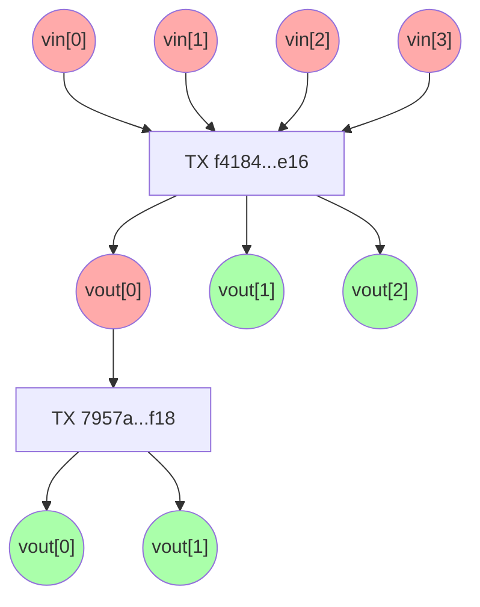

# Smart Contracts em 10 minutos

Acordos confiáveis para ambientes de desconfiança

<div class="pt-12">
    Fabricio C Zuardi, Abril 2022
</div>

<div class="abs-br m-6 flex gap-2">
  <a href="https://github.com/titulos/nft-101" target="_blank" alt="GitHub"
    class="text-xl icon-btn opacity-50 !border-none !hover:text-white">
    <carbon-logo-github />
  </a>
</div>

<!--
Olá,meu nome é Fabricio e esta é mais uma apresentação na série de materiais sobre web3.

Hoje vamos falar sobre smart contracts.
-->

---
layout: default
---

# Contratos
graus de confiança, privacidade, garantias e necessidade de uma autoridade central

  - comprar refrigerante no supermercado online
  - comprar refrigerante no supermercado presencial
  - comprar refrigerante fiado na cantina da escola
  - comprar refrigerante numa vending machine

<!--
Antes de entrar no assunto principal, gostaria de propor uma rápida reflexão sobre alguns acordos entre pessoas.

Por exmeplo: a compra de um refrigerante em diferentes ambientes tem diferentes graus de confiança, privacidade e garantias.

Comprar uma lata de coca no SITE do supermercado, no supermercado, na cantina da escola, fiado para acertarna virada do mes,e numa vending machine.
-->

---
layout: default
---

# Contratos
graus de confiança, privacidade, garantias e necessidade de uma autoridade central

  - alugar uma casa com a ajuda de uma imobiliária
  - alugar uma chácara direto com o dono para uma festa de fim de semana
  - dormir de favor na casa de um familiar

<!--
Mais tres situacoes de acordos parecidos com diferentes graus de  privacidade, e confiança, e com diferentes protocolos e garantas:

- alugar um imóvel para morar
- alugar um imóvel para um evento 
- pedir abrigo aum familiar
-->

---
layout: default
---

# Contratos
graus de confiança, privacidade, garantias e necessidade de uma autoridade central

  - fazer um empréstimo no banco
  - fazer um empréstimo com um agiota
  - fazer um empréstimo com a mãe

<!--
um emprestimo de dinheiro  em diferentes situações
-->

---
layout: default
---

# Contratos
graus de confiança, privacidade, garantias e necessidade de uma autoridade central

  - parar o carro no sinal vermelho
  - andar abaixo da velocidade máxima permitida numa estrada
  - dar o lugar no ônibus para a idosa

<!--
E outros exemplos de acordos sociais, como obedecer ao semáforo, ao radar da estrada ou aos bons costumes.
-->

---

# Contratos com a ajuda de autoridades

- acordos entre humanos normalmente envolvem autoridades centrais
  - exemplos: condições para liberar um empréstimo no banco
- desenhar acordos sem o uso dessas autoridades é difícil
  - exemplos: cheque-calção
  - pensar na teoria dos jogos dos protocolos é o mais importante

<!--
Parafechar esta introducao, quero falar sobre a ajuda deautoridades centrais, nestes diferentes cenários.Acordos entre...

E desenhar contratos que nao dependam de uma auoridade central é difícil, princialmente em ambientes onde a desconfiança é grande.

Neses casos, o contrato tem que ser pensado com uma mentalidade de teoria dos jogos, com ajuda de mais provas,mais garantias,mais pensamento adversário.O cheque cação noaluguel de uma chacara para evento éum dispositivo desses,
-->

---
layout: cover
background: >-
  https://images.unsplash.com/photo-1533969206871-9be1be6cb3e6?ixlib=rb-1.2.1&q=80&fm=jpg&crop=entropy&cs=tinysrgb&dl=marcus-loke-o0SWpJQCzrY-unsplash.jpg&w=1920
---

# Smart Contracts

<!--
A internet é um ambiente hosil, anárquico e de muita desconfiança. O conceito de smart contracts nasce de uma necessidade de codificar contratos nesse tipo de ambiente...
-->

---
layout: cover
background: >-
  https://images.unsplash.com/photo-1638949493140-edb10b7be2f3?ixlib=rb-1.2.1&q=80&fm=jpg&crop=entropy&cs=tinysrgb&dl=douglas-monterrosa-rHKYg9rb074-unsplash.jpg&w=1920
---

<blockquote>
Smart contract is the way to <mark>enforce</mark> the fulfillment of a certain <mark>agreement</mark> between humans <mark>without</mark> an external <mark>centralized agency</mark> (military, government, court etc).
</blockquote>

[RGB Protocol FAQ](https://www.rgbfaq.com/rgb-smart-contracts/what-is-a-smart-contract)

<!--
de forma que seja possivel garatir que acordos sejam.cumpridos sem a necessidade de uma entidade central, como um tribunal, um governo ouum exército.

Esta é uma definição de smart contract tirada do FAQ do protocolo RGB, que é um projeto baseado em Bitcoin
-->

---
layout: cover
background: >-
  https://images.unsplash.com/photo-1578783204979-27a2e3de3746?ixlib=rb-1.2.1&q=80&fm=jpg&crop=entropy&cs=tinysrgb&dl=erik-mclean-ifbVa1gYDnA-unsplash.jpg&w=1920
---

<blockquote>The basic idea of smart contracts is that many kinds of <mark>contractual clauses</mark> (such as liens, bonding, delineation of property rights, etc.) can be <mark>embedded in the hardware and software</mark> we deal with, in such a way as to make breach of contract expensive (if desired, sometimes prohibitively so) for the breacher. A canonical <mark>real-life example</mark>, which we might consider to be the primitive ancestor of smart contracts, is the humble <mark>vending machine</mark>.</blockquote> -- Szabo, 1996

<!--
Nos textos mais clássicos, como os do Nick Szabos, a ideia é semelhante,e seria a ideia de que os contratos podem ser EMBUTIDOS nos softwares e nos hardwares queutilizamos. O exemplo no mundo físico deste tipo de hardware que tras emsi proprio as cláusulas do acordo é uma vending machine.
-->

---
layout: image
image: >-
  https://images.unsplash.com/photo-1597178003028-15e0aa139905?ixlib=rb-1.2.1&q=80&fm=jpg&crop=entropy&cs=tinysrgb&dl=waldemar-brandt-rDrGfuplEm8-unsplash.jpg&w=1920
---

https://unsplash.com/photos/ifbVa1gYDnA

<!--
Coloquei aqui mais um exemplo parecido,o de um telefone púlico. Que é fisicamente bem mais resistente que um caseiro, por estar num ambiente mais hostil, menos suervisionado.

E um telefone público é um contrato de serviço sob-demanda, ele vai manter sua ligação ativa enquanto estiver recebendo dinheiro.Este éo contrato.
-->

---
layout: cover
background: >-
  https://images.unsplash.com/photo-1570912355338-cdb934b76b12?ixlib=rb-1.2.1&q=80&fm=jpg&crop=entropy&cs=tinysrgb&dl=emiel-maters-3a7nrgYSbRE-unsplash.jpg&w=1920
---

# Bitcoin Transactions

<!--
Vamos falar de blockchain aberta então. Vamos falar de uma rede de adesão voluntária, "permissionless".  Um ambientes público, onde a necessidade de confiança é minimizada por meio de criptografia. Para continuar no tema de smart contracts vamos falar sobre transações na rede Bitcoin. Que é a blockchain pública mais segura e mais relevante do planeta.
-->

---

# Bitcoin Transaction (Tx)
Exemplo de uma transação com uma entrada e duas saídas do tipo P2PKH (Pay to Public Key Hash)

```json
{
  "version": 1,
  "locktime": 0,
  "vin": [
    {
      "txid": "7957a35fe64f80d234d76d83a2a8f1a0d8149a41d81de548f0a65a8a999f6f18",
      "vout": 0,
      "scriptSig" : "3045022100884d142d86652a3f47ba4746ec719bbfbd040a570b1deccbb6498c75c4ae24cb02204b9f039ff08df09cbe9f6addac960298cad530a863ea8f53982c09db8f6e3813[ALL] 0484ecc0d46f1918b30928fa0e4ed99f16a0fb4fde0735e7ade8416ab9fe423cc5412336376789d172787ec3457eee41c04f4938de5cc17b4a10fa336a8d752adf",
      "sequence": 4294967295
    }
  ],
  "vout": [
    {
      "value": 0.01500000,
      "scriptPubKey": "OP_DUP OP_HASH160 ab68025513c3dbd2f7b92a94e0581f5d50f654e7 OP_EQUALVERIFY OP_CHECKSIG"
    },
    {
      "value": 0.08450000,
      "scriptPubKey": "OP_DUP OP_HASH160 7f9b1a7fb68d60c536c2fd8aeaa53a8f3cc025a8 OP_EQUALVERIFY OP_CHECKSIG",
    }
  ]
}
```

<!--
Este é o conteúdo de uma "transaction" na blockchain Bitcoin.

Uma transação na Bitcoin é um registro de uma mudança de estado, é a forma de transferir valores. 

Uma transação pode ter muitas entradas e muitas saidas, as entradas são referências de "endereços" que o autor da transação comprovou poder usar. E as saídas são os destinos para onde os valores contidos nos inputs serão transferidos.

Note que as origens e os destinos nao sao pessoas, contas com saldo ou algo assim, uma transacao é uma lista de entradas, que sao referencias a saidas específicas de outras transacoes. E um lista de sáídas, que poderam ser "gastas" no futuro, isto é: poderão estar na lista de inputs de uma outra transação.
-->

---
layout: two-cols
---

# Bitcoin Transactions (Tx)



<v-click at="1">

<span style="color:green">Out: <mdi-signature /> <carbon-locked /></span>
<span style="margin-left:2rem;color:darkred">In: <mdi-signature-freehand /> <carbon-unlocked /></span>

</v-click>

::right::

<v-click at="3">

<div style="display:flex">
<div style="overflow:hidden;border-radius:100%;height:16rem;margin-top:1rem;margin-bottom:1rem;align-items:center">

</div>
<div>

- _wallet_ = chaveiro
  - uma _wallet_ é quem monitora quais UTXOs você consegue destravar/gastar

</div>
</div>

</v-click>

<div v-click="2" style="margin-top:0">

# Saídas não gastas (UTXO)
## Unspent Transaction Output

  - value
  - locking scripts
    - scriptPubKey, witnessScript

</div>

<!--
A transacao do slide anteror é a que eu coloquei mais abaixo aqui neste diagrama. É uma transaction com um único input e dois outputs.

Pintei de verde aqui as saídas,os outputs, que não foram gastos,ou seja,os que ainda não viraram inputs de outras transações. E de vermelho pintei as saídas já gastas.CLICK

Para um output de uma tx se tornar input de outra transação, alguma prova tem que ser apresentada, uma assinatura por exemplo.CLICK

Nossas bolas verdes aqui entao sao UTXO, e possuem um valor junto com uma fechadura, um programa de tranca,um locking script, uma spending condition. 

As vermelhas outputs gastos, são entradas, são STXO, elas posuem a referencia da transação de origem e algum tipo de prova que destrancou o valor.CLICK

Nesse contexto, vale esclarecer o que é um software de wallet. É um software que conhece um conjunto de chaves e monitora as saídas nao gastas na blockchain para saber quanto dos valores ainda trancadoso dono da wallet conseguiria destravar, gastar, movimentar. Uma melhor metáfora seriam chaveiro,um caderninho de senhas,algo assim.Pensar em wallet como carteira pode passar a ideia errada de que as moedas estao no apareho da pessoa, nao estão.
-->

---

# Bitcoin Transacrion (Tx)

<v-click at="3" >

## locking scripts são smart contracts

</v-click>

```json{all|4,8,12,15|15}
{
  "version": 1,
  "locktime": 0,
  "vin": [
    {
      "txid": "7957a35fe64f80d234d76d83a2a8f1a0d8149a41d81de548f0a65a8a999f6f18",
      "vout": 0,
      "scriptSig" : "3045022100884d142d86652a3f47ba4746ec719bbfbd040a570b1deccbb6498c75c4ae24cb02204b9f039ff08df09cbe9f6addac960298cad530a863ea8f53982c09db8f6e3813[ALL] 0484ecc0d46f1918b30928fa0e4ed99f16a0fb4fde0735e7ade8416ab9fe423cc5412336376789d172787ec3457eee41c04f4938de5cc17b4a10fa336a8d752adf",
      "sequence": 4294967295
    }
  ],
  "vout": [
    {
      "value": 0.01500000,
      "scriptPubKey": "OP_DUP OP_HASH160 ab68025513c3dbd2f7b92a94e0581f5d50f654e7 OP_EQUALVERIFY OP_CHECKSIG"
    },
    {
      "value": 0.08450000,
      "scriptPubKey": "OP_DUP OP_HASH160 7f9b1a7fb68d60c536c2fd8aeaa53a8f3cc025a8 OP_EQUALVERIFY OP_CHECKSIG",
    }
  ]
}
```

<!--
Voltando ao formato da transaction:CLICK CLICK

O input tem a prova que destrava um output nao gasto.

Os outputs possuem novas trancas, scriptPubKey, uma condição de gasto, um código-fonte de um programa, um locking script.CLICK 

Locking scripts são smart contracts. Aquele que satisfizer o enigma do script de tranca fornecendo a prova esperada tem direito de reivindicar o valor de um UTXO.

O destnatário de uma transacao de bitcoin nao é uma PESSOA,é um PROGRAMA DE COMPUTADOR.
-->

---

# Apêndice: Bitcoin Script


  - Script is a mini programming language used as a locking mechanism for outputs
  - Standard Scripts
    - [P2PK](https://learnmeabitcoin.com/technical/p2pk) (Pay To Pubkey), [P2PKH](https://learnmeabitcoin.com/technical/p2pkh) (Pay To Pubkey Hash), [P2MS](https://learnmeabitcoin.com/technical/p2ms) (Pay To Multisig), [P2SH](https://learnmeabitcoin.com/technical/p2sh) (Pay To Script Hash, [BIP-16](https://github.com/bitcoin/bips/blob/master/bip-0016.mediawiki)), [NULL DATA](https://learnmeabitcoin.com/technical/nulldata), [P2WPKH](https://github.com/bitcoin/bips/blob/master/bip-0141.mediawiki#P2WPKH) (Pay to Witness Pubkey Hash), [P2WSH](https://github.com/bitcoin/bips/blob/master/bip-0141.mediawiki#p2wsh) (Pay to Witness Script Hash), [PSH-P2WPKH](https://github.com/bitcoin/bips/blob/master/bip-0141.mediawiki#p2wpkh-nested-in-bip16-p2sh), [PSH-PWSH](https://github.com/bitcoin/bips/blob/master/bip-0141.mediawiki#p2wsh-nested-in-bip16-p2sh)
  - Outras linguagens de smart contracts: [Miniscript](https://bitcoin.sipa.be/miniscript/), [Minsc](https://min.sc/), [Solidity](https://soliditylang.org/) (ETH, RBTC), [RGB Schema](https://www.rgbfaq.com/glossary/schema-and-scripts/schema), [Clarity](https://clarity-lang.org/) (STX)

<!--
Vou deixar aqui um slide extra, que fala sobre a linguagem de programação utilizada por smart contracts na blockchain aberta da Bitcoin, que é a Btcoin Script. É uma linguagem de programação simples e com poucas instruções. Porém já é o suficiente para codificar muitos tipos de contratos, como: contas compartilhadas, arranjos multi-sig de n-m,por exemplo: só autoriza um saque se 3 chaves de um grupo com 5 assinarem, liberar um dinheiro só depois depassado um tempo (x blocos,timelock) e por aí vai. 

Existem também linguagens mais ergonomicas que transpilam para  Bitcoin Script, como a Miniscript e a Minsc e propostas de linguagens mais declarativas para codificar smart contracts, como é o caso do projeto RGB e a RGB Schema.

Outras redes, como a Ethereum ou outras altcoins baseadas nas ferramentas e runtime de Ethereum, usam uma linguagem chamada Solidty.Existe até implementacoes da VM Ehereum,com suporte a Solidity na redeBitcoin, que é o projeo RSK, Rootstock.
-->

---

# Sumário

- escrever contratos é codificar promessas/acordos
  - exemplo: condições para liberar um dinheiro
- desenhar acordos sem autoridades é difícil
  - pensar na teoria dos jogos dos protocolos é mais importante e vem antes da implementação em código

<!--
Fechando...
-->

---

# Referências

- https://github.com/bitcoinbook/bitcoinbook/blob/develop/ch06.asciidoc
- https://learnmeabitcoin.com/technical/script
- https://learnmeabitcoin.com/technical/p2pkh
- [Smart Contracts: Building Blocks for Digital Markets](https://www.fon.hum.uva.nl/rob/Courses/InformationInSpeech/CDROM/Literature/LOTwinterschool2006/szabo.best.vwh.net/smart_contracts_2.html), Nick Szabo, 1996
- [What is a smart contract?](https://www.rgbfaq.com/rgb-smart-contracts/what-is-a-smart-contract), RGB FAQ

## Fotos

- [Old vault in the center of Maastricht with the original cases](https://unsplash.com/photos/3a7nrgYSbRE?utm_source=unsplash&utm_medium=referral&utm_content=creditShareLink). Photo by <a href="https://unsplash.com/@emielmaters?utm_source=unsplash&utm_medium=referral&utm_content=creditCopyText">Emiel Maters</a>
- [Silver key on black car](https://unsplash.com/photos/7mgR-BZ5Dm4?utm_source=unsplash&utm_medium=referral&utm_content=creditShareLink).Photo by <a href="https://unsplash.com/@ivanshemereko?utm_source=unsplash&utm_medium=referral&utm_content=creditCopyText">Ivan Shemereko</a>
- [A vintage telephone box in Pertisau, Austria](https://unsplash.com/photos/rDrGfuplEm8). Photo by <a href="https://unsplash.com/@waldemarbrandt67w?utm_source=unsplash&utm_medium=referral&utm_content=creditCopyText">Waldemar Brandt</a>
- https://unsplash.com/photos/o0SWpJQCzrY
- https://unsplash.com/photos/ifbVa1gYDnA

---
layout: intro
---

# <logos-bitcoin />  Obrigado <twemoji-high-voltage />

<carbon-earth /> https://blog.fabricio.org • [<uim-github />/fczuardi](https://github.com/fczuardi) • [<uim-twitter />/fczuardi](https://twitter.com/fczuardi) • [<uim-linkedin />/in/fabricio](https://linkedin.com/in/fabricio)
